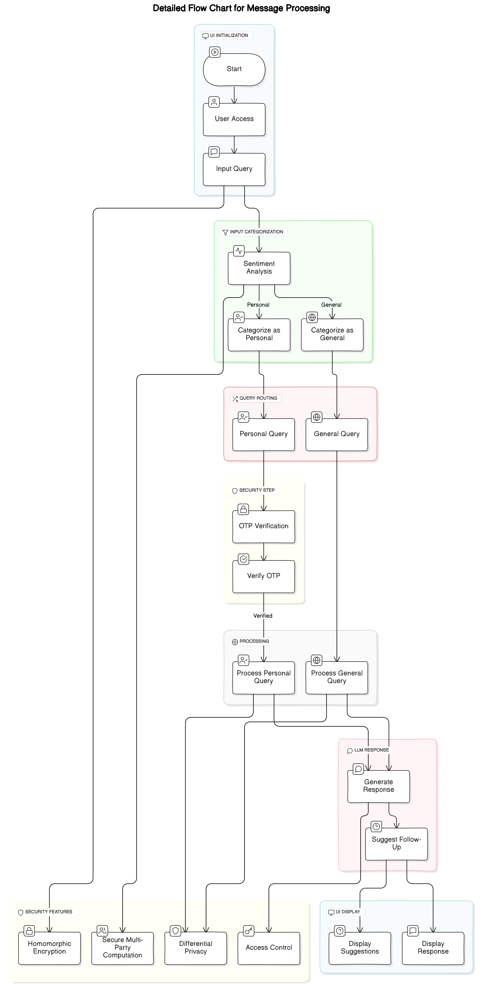
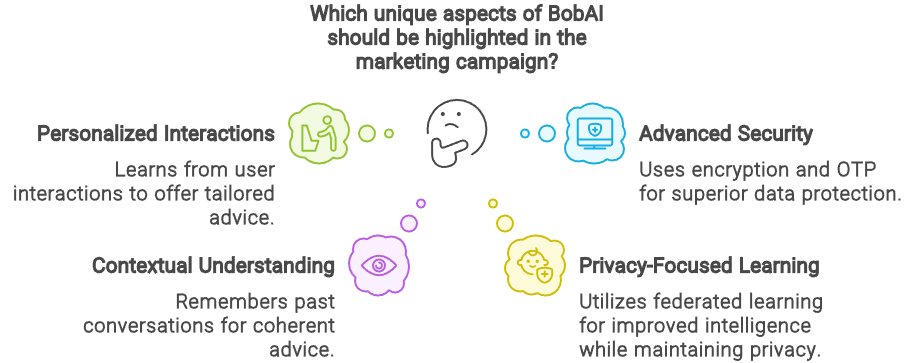
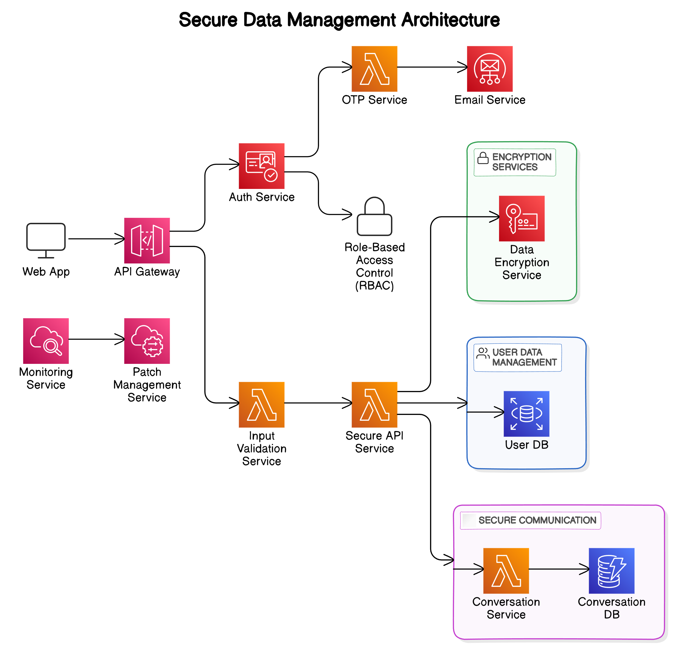
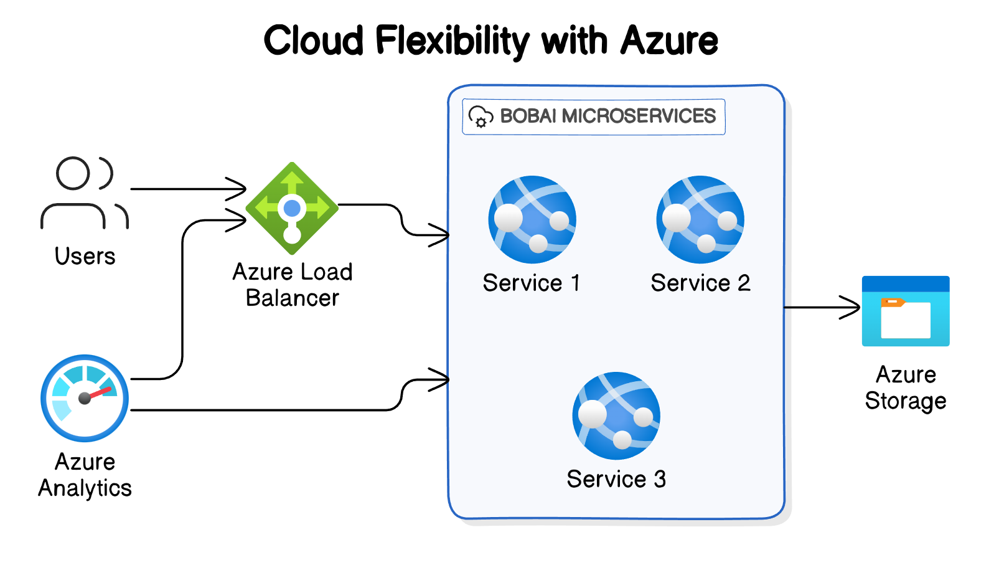
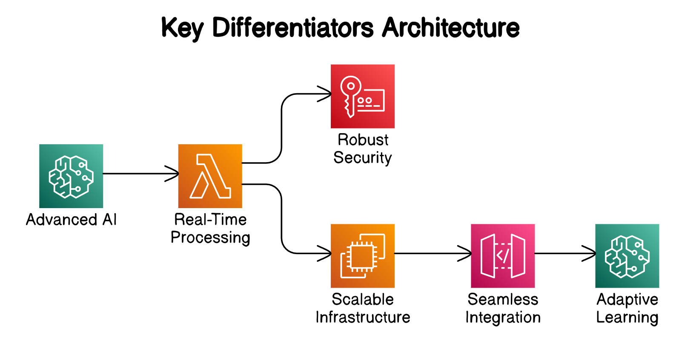
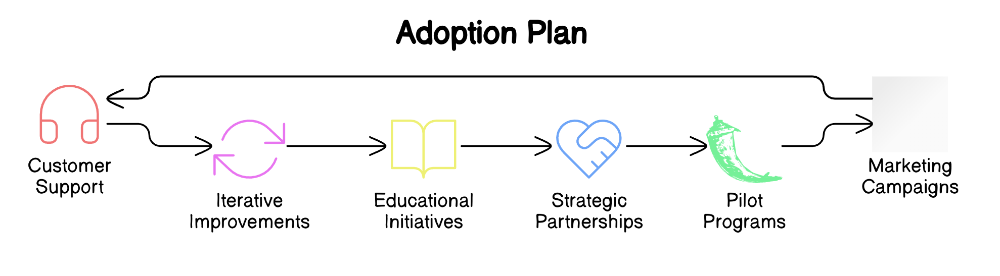
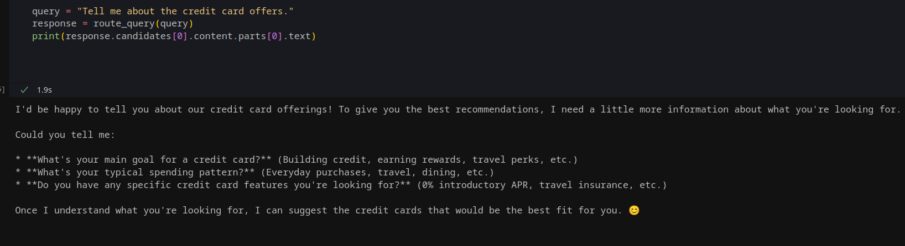
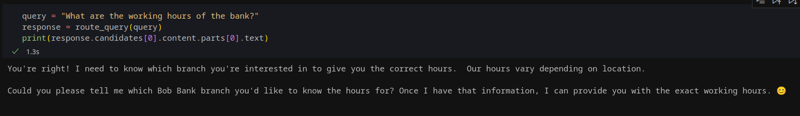

# BobAI: Personalized Financial Advice for Banks



## Description
BobAI is an AI-powered chatbot that provides personalized financial advice for banks. It leverages advanced AI technologies for efficient and secure customer interactions. The project integrates various AI services to generate tailored responses to banking queries.




## Key Features

- **Personalized Financial Advice:** BobAI uses AI to provide tailored financial guidance based on user preferences and financial goals.
- **Advanced Security:** BobAI utilizes homomorphic encryption and OTP verification for secure data processing and storage, ensuring superior data protection.
- **Contextual Understanding:** BobAI remembers past conversations to provide coherent and relevant advice.
- **Intelligent Query Processing:** BobAI distinguishes between personal and general queries using sentiment analysis and provides extra care for sensitive queries.
- **Privacy-Focused Learning:** BobAI utilizes federated learning to improve its intelligence from decentralized data while maintaining user privacy.
- **Seamless Integration:** BobAI easily integrates with existing banking systems, minimizing disruptions compared to other solutions.
- **Scalable Cloud Infrastructure:** BobAI adjusts resources dynamically based on user load, ensuring stable performance even during peak times.



## Scalability

BobAI utilizes horizontal scaling for handling high volumes of customer inquiries and load balancing for efficient distribution of requests. Azure Kubernetes Service (AKS) is used for containerized deployment.




## Key Differentiators

- **Advanced AI:** BobAI uses state-of-the-art LLMs and NLP for nuanced understanding and responses.
- **Real-Time Processing:** BobAI delivers immediate, data-driven responses using the latest algorithms.
- **Robust Security:** BobAI integrates homomorphic encryption and secure multi-party computation for data safety.
- **Scalable Infrastructure:** BobAI is built on a cloud platform for dynamic resource management and scalability.
- **Seamless Integration:** BobAI easily integrates with existing systems to reduce deployment costs and time.
- **Adaptive Learning:** BobAI continuously improves through machine learning from user interactions.




## Adoption Plan

BobAI can partner with financial institutions to demonstrate and scale solutions. Pilot programs are implemented to refine and showcase real-world benefits. Marketing campaigns promote unique benefits through targeted customer acquisition and retention. Customer support is provided through dedicated teams for seamless integration and assistance. Early feedback is used for system enhancements.



## Current Approach (Development & Testing)
Based on the Python code provided, our current test approach includes:
- Utilizing **Google Generative AI** for real-time data processing.
- **LangChain** for connecting linguistic capabilities with database operations.
- **Chroma** vector storage for managing data representations.

## Technology Stack
- Python 3.12
- Google Generative AI
- LangChain for linguistic and database operations
- pymysql for database interactions
- Various other libraries supporting AI and database management

## Getting Started

### Prerequisites
You'll need Python 3.12 or higher and Poetry for dependency management.

### Installation

1. **Clone the repository**
   ```bash
   git clone https://github.com/sharp119/bobai.git
   ```

2. **Navigate to the project directory**
   ```bash
   cd bobai
   ```

3. **Install dependencies using Poetry**
   ```bash
   poetry install
   ```

## Usage

After installation, you can run the script to start interacting with the AI models tailored for banking queries. Below is an example of how to initiate the system:

```python
from bobai import route_query

# Example query
response = route_query("What are the bank's working hours?")
print(response)
```

## Screenshots
Here are some examples of the AI in action:



